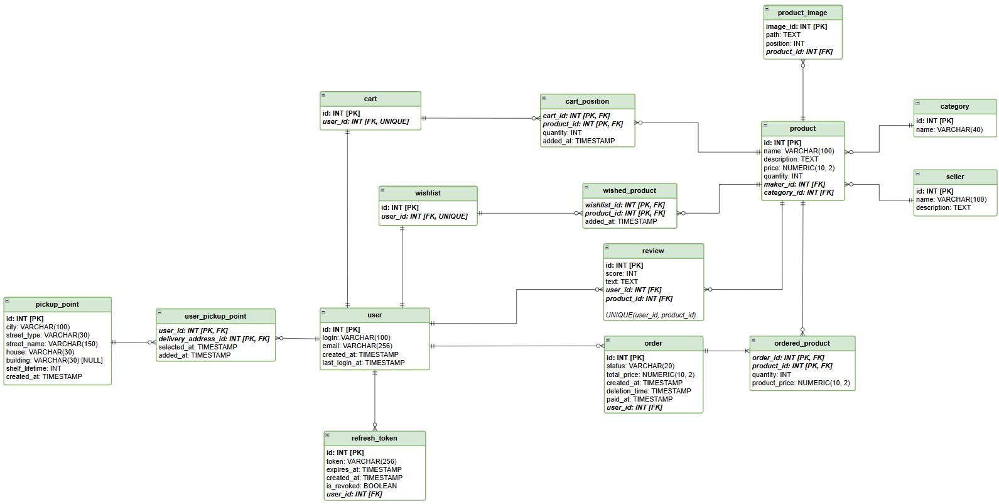
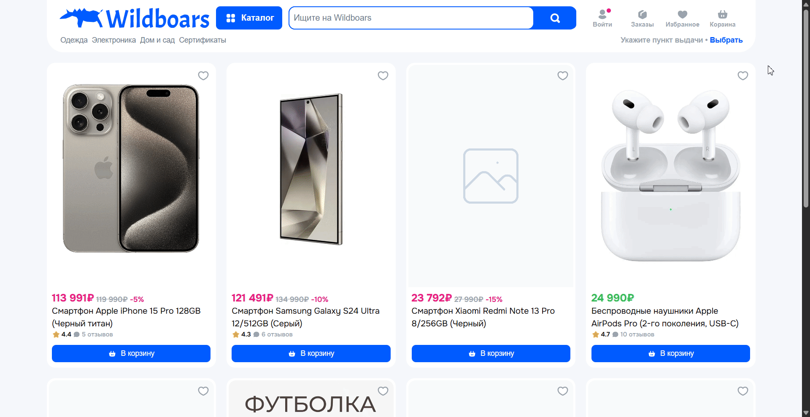
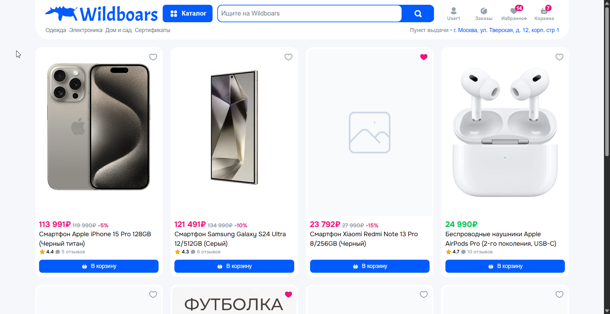
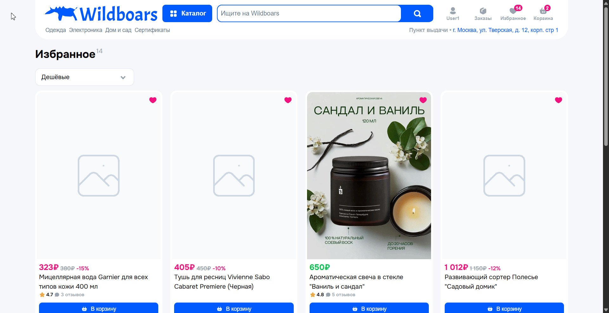

# E-Commerce Marketplace

Pet-проект маркетплейса в духе Ozon.

<!-- TOC -->
* [E-Commerce Marketplace](#e-commerce-marketplace)
  * [Стек технологий](#стек-технологий)
  * [Функциональность](#функциональность)
  * [Quick Start](#quick-start)
    * [Запуск](#запуск)
    * [Доступные сервисы](#доступные-сервисы)
  * [Базы данных](#базы-данных)
    * [Подключение](#подключение)
    * [Схема БД](#схема-бд)
  * [Примеры работы](#примеры-работы)
    * [Авторизация/Регистрация](#авторизациярегистрация)
    * [Скролл](#скролл)
    * [Оформление заказа](#оформление-заказа)
<!-- TOC -->

## Стек технологий

**Frontend:** TypeScript, React, FSD Architecture, Zustand.

**Backend & Infrastructure:** .NET (C#, ASP.NET, EF Core), PostgreSQL, Redis, Traefik, Nginx, Docker.

## Функциональность

* Регистрация и авторизация.
* Каталог товаров с infinite scroll.
* Корзина: добавление/удаление товаров, пересчёт суммы.
* Список избранного.
* Оформление заказа.
* Глобальная обработка ошибок.

## Quick Start

### Запуск

Проект полностью упакован в Docker-контейнеры. Для локального запуска у вас должен быть установлен Docker.

1. Перейдите в корневую папку проекта.
2. Выполните сборку образов и запуск контейнеров в фоновом режиме:
   ```bash
   docker compose build --no-cache
   docker compose up -d
   ```

### Доступные сервисы

После успешного запуска контейнеров, сервисы будут доступны по следующим адресам:

**Frontend:** http://localhost:8000/web/

**Backend API:** http://localhost:8000/swagger/

## Базы данных

### Подключение

Для подключения к БД через сторонние клиенты используйте следующие данные:

**PostgreSQL**

+ ***Host:*** localhost
+ ***Port:*** 8002
+ ***Database:*** main_db
+ ***Username:*** postgres
+ ***Password:*** 1234

**Redis**

+ ***Host:*** localhost
+ ***Port:*** 8003

### Схема БД



## Примеры работы

### Авторизация/Регистрация



### Скролл



### Оформление заказа

